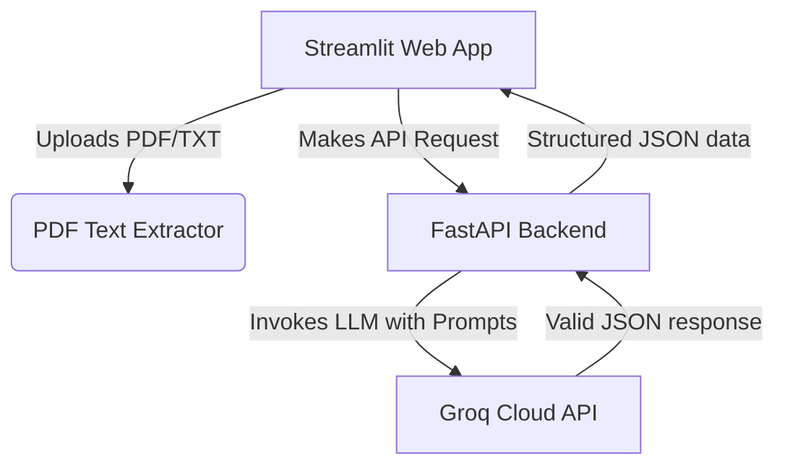

# AI Job Assistant - API & Project Documentation\n\n*Standard Reference Manual for Core Service Interfaces*

Welcome to the **AI Job Assistant** documentation. This project provides an end-to-end suite designed to help job seekers optimize their resumes, parse requirements, and write custom outreach templates.

The system is split into two components:
1. **FastAPI Backend**: Serves robust, JSON-based rest API endpoints driven by the **Groq LLM (Llama-3.3-70b-versatile)**.
2. **Streamlit Frontend**: An interactive, responsive web portal where users can match resumes (supporting PDF & TXT uploads) and generate cold outreach templates.

---

## Architecture Flow



---

## 🛠️ API Reference & Endpoints

### 1. Job Description Requirement Extractor

Extracts core skills, key responsibilities, experience levels, and primary keywords from a raw job description block.

- **Endpoint**: `POST /api/parse-jd`
- **Content-Type**: `application/json`
- **Request Payload**:
  ```json
  {
    "job_description": "We are seeking a Senior React Developer with 5+ years of experience in JavaScript, TypeScript, and state management like Redux. You will be responsible for designing high-performance reusable UI components and leading frontend sprints."
  }
  ```
- **Response Shape (200 OK)**:
  ```json
  {
    "skills": ["React", "JavaScript", "TypeScript", "Redux"],
    "responsibilities": [
      "Designing high-performance reusable UI components",
      "Leading frontend sprints"
    ],
    "experience_level": "Senior (5+ years)",
    "keywords": ["React", "TypeScript", "Redux", "reusable UI", "frontend sprints"]
  }
  ```

---

### 2. Resume Matcher & Optimizer

Compares raw resume text against a target job description to compute a matching percentage, identify candidate strengths, and provide specific, actionable enhancements.

- **Endpoint**: `POST /api/analyze-resume`
- **Content-Type**: `application/json`
- **Request Payload**:
  ```json
  {
    "resume_text": "Experienced Frontend Engineer with 4 years of expertise building user interfaces in React and JavaScript. Strong focus on component optimization and Redux state architecture.",
    "job_description": "We are seeking a Senior React Developer with 5+ years of experience in JavaScript, TypeScript, and state management like Redux. You will be responsible for designing high-performance reusable UI components."
  }
  ```
- **Response Shape (200 OK)**:
  ```json
  {
    "match_percentage": 80,
    "strengths": [
      "Strong background in React and JavaScript matching the core tech stack.",
      "Demonstrated experience with Redux state architecture matches requirements."
    ],
    "improvements": [
      "Explicitly mention TypeScript in your resume to match the required languages.",
      "Add detail about designing high-performance reusable UI components under your experience bullet points.",
      "Highlight leadership capabilities to align with the 'Senior' level requirement."
    ]
  }
  ```

---

### 3. Cover Message & Outreach Generator

Generates a customized, high-converting cover letter or LinkedIn/cold email pitch matching the candidate's profile to the target role.

- **Endpoint**: `POST /api/generate-cover-message`
- **Content-Type**: `application/json`
- **Request Payload**:
  ```json
  {
    "company_name": "Stripe",
    "role": "Frontend Developer",
    "resume_text": "Experienced Frontend Engineer with 4 years of expertise building user interfaces in React and JavaScript.",
    "job_description": "We are seeking a React Developer with experience in web interfaces and payment integrations."
  }
  ```
- **Response Shape (200 OK)**:
  ```json
  {
    "cover_message": "Dear Hiring Team at Stripe,\n\nI am writing to express my enthusiasm for the Frontend Developer position. With over 4 years of experience building high-quality user interfaces using React and JavaScript, I am confident in my ability to contribute immediately to your product pipeline.\n\nThroughout my career, I have focused on designing clean, reusable UI architectures that optimize performance and improve UX. Stripe's commitment to building seamless developer tools resonates deeply with my philosophy of engineering. I would love the opportunity to leverage my expertise to build robust front-end interfaces and help expand Stripe's payment ecosystems.\n\nThank you for your time and consideration. I look forward to discussing how my background aligns with your team's objectives.\n\nSincerely,\n[Your Name]"
  }
  ```

---

## ⚡ Setup and Running Instructions

1. **Check `.env` parameters**:
   Ensure `GROQ_API_KEY`, `SUPABASE_URL`, and `SUPABASE_KEY` are defined.

2. **Run Backend Server (FastAPI)**:
   ```bash
   .\venv\Scripts\uvicorn app.main:app --reload --port 8000
   ```

3. **Run UI App (Streamlit)**:
   ```bash
   .\venv\Scripts\streamlit run streamlit_app.py
   ```
