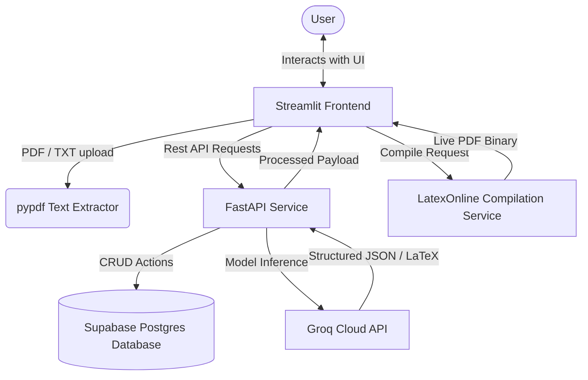

# AI Job Assistant & Resume Optimizer\n\n*Enterprise Copilot Platform for Automated Resume Alignment and Outreach Engineering*

AI Job Assistant is a local copilot designed to help job seekers optimize their resumes, extract job description requirements, and generate tailored cover letters. The project consists of a high-performance FastAPI backend service driven by Large Language Models via the Groq SDK and a responsive Streamlit web application.

---

## Architecture Flow

The system architecture is structured to separate concern between frontend user experience, API routing, database tracking, and generative AI services:



* **Frontend**: Streamlit-based user interface utilizing custom CSS, glassmorphism card styling, responsive layout structures, and raw SVG indicators for match scores.
* **Backend**: FastAPI REST framework organizing routers into modular endpoints (`jd_routes`, `ai_routes`, `application_routes`).
* **Database**: Supabase client integration for storing and managing job application states (Applied, Interviewing, Offer, etc.).
* **Generative Core**: Direct Groq API integration utilising `llama-3.3-70b-versatile` with automated fallback to `llama-3.1-8b-instant` for resilient, zero-overhead generation.
* **Compilation**: LaTeXOnline compilation API for instant PDF generation alongside a direct 1-click cloud export to Overleaf.

---

## Core Features

* **ATS Matching**: Compares your resume to the job description and gives a match score, strengths, and areas to improve.
* **Job Parser**: Extracts skills, keywords, and requirements from any job description block.
* **Smart LaTeX Resume Tailoring**: Generates a tailored LaTeX resume matching your credentials to the role.
  * **Keeps Sections**: Retains custom sections from your original resume like Certifications, Languages, or Awards.
  * **No Summary**: Omits summaries to save layout space for concrete work experience and projects.
  * **Clean Formatting**: Auto-escapes special LaTeX symbols (`&`, `_`, `%`) and splits project titles with a simple ` - ` dash.
  * **1-Page Limit**: Scales bullet details to perfectly fit exactly one page.
* **Cover Letters**: Auto-generates customized outreach messages and cover letters.
* **Applications Tracker**: An interactive dashboard backed by Supabase to log and track your job application pipeline.

---

## Project Structure

```text
ai-job-assistant/
├── app/
│   ├── db/
│   │   └── supabase_client.py  # Supabase client initializer
│   ├── resources/
│   │   └── default_resume.tex  # LaTeX master template
│   ├── routes/
│   │   ├── ai_routes.py        # Resume matcher & outreach API endpoints
│   │   ├── application_routes.py # Job tracking database API
│   │   └── jd_routes.py        # Job description requirements parser API
│   ├── services/
│   │   └── ai_service.py       # Groq client logic & prompt tailoring
│   └── main.py                 # FastAPI application initialization
├── streamlit_app.py            # Streamlit dashboard & LaTeX-PDF compiler
├── API_DOCUMENTATION.md        # API reference shapes & payloads
├── .env                        # Configuration secrets
└── README.md                   # Project documentation
```

---

## Installation & Setup

### Prerequisites
* Python 3.10 or higher
* Groq API Key
* Supabase Account & Database

### 1. Clone & Set Up Virtual Environment
```bash
git clone https://github.com/PythonicDG/ai-job-assistant.git
cd ai-job-assistant

# Create virtual environment
python -m venv venv

# Activate virtual environment (Windows)
.\venv\Scripts\activate

# Activate virtual environment (Mac/Linux)
source venv/bin/activate
```

### 2. Install Dependencies
```bash
pip install -r requirements.txt
```
*(Dependencies include: `fastapi`, `uvicorn`, `streamlit`, `groq`, `supabase`, `python-dotenv`, and `pypdf`)*

### 3. Configure Environment Variables
Create a `.env` file in the root directory:
```env
GROQ_API_KEY=your_groq_api_key_here
SUPABASE_URL=your_supabase_project_url_here
SUPABASE_KEY=your_supabase_anon_key_here
BACKEND_URL=http://localhost:8000
```

### 4. Run the Application

Start both the backend server and frontend dashboard:

**Step A: Launch FastAPI Backend**
```bash
uvicorn app.main:app --reload --port 8000
```
The backend server runs locally at `http://localhost:8000` with interactive Swagger docs accessible at `http://localhost:8000/docs`.

**Step B: Launch Streamlit Dashboard**
In a new terminal window (with the virtual environment activated):
```bash
streamlit run streamlit_app.py
```
The frontend dashboard will automatically launch in your browser at `http://localhost:8501`.

---

## API Endpoints

### `POST /api/parse-jd`
Extracts structural requirements (skills, keywords, responsibilities, experience level) from a job description.
* **Payload**: `{"job_description": "text"}`
* **Response**: Structurally parsed JSON object.

### `POST /api/analyze-resume`
Evaluates a candidate's compatibility rating against a target job posting.
* **Payload**: `{"resume_text": "text", "job_description": "text"}`
* **Response**: Match score percentage, strengths list, and optimization recommendations.

### `POST /api/generate-cover-message`
Creates a tailored cover letter/outreach pitch.
* **Payload**: `{"resume_text": "text", "job_description": "text", "company_name": "text", "role": "text"}`
* **Response**: Generative outreach template.

### `POST /api/generate-tailored-resume`
Synthesizes customized, ATS-optimized LaTeX code matching the candidate's credentials to the role.
* **Payload**: `{"resume_text": "text", "job_description": "text", "company_name": "text", "role": "text"}`
* **Response**: Raw compiled LaTeX code, formatted plain text copy, and an evaluation log of modifications.
